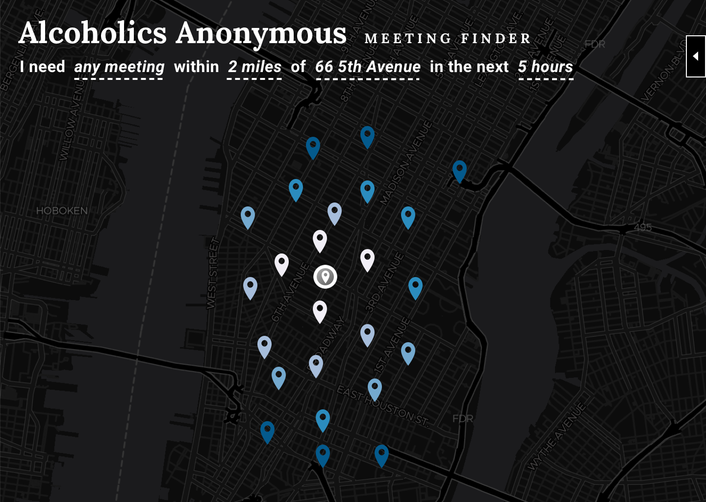
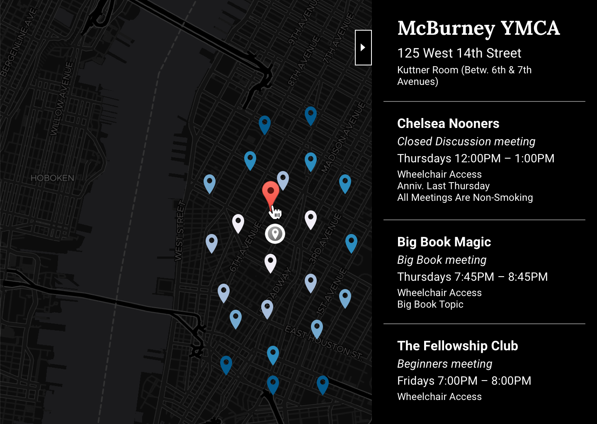
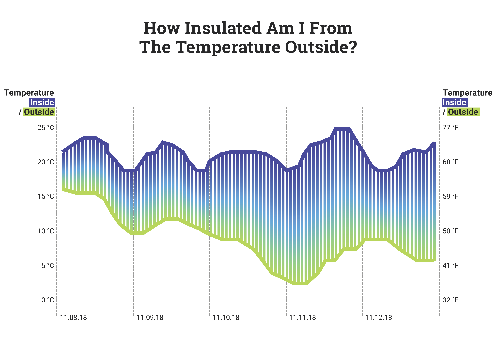
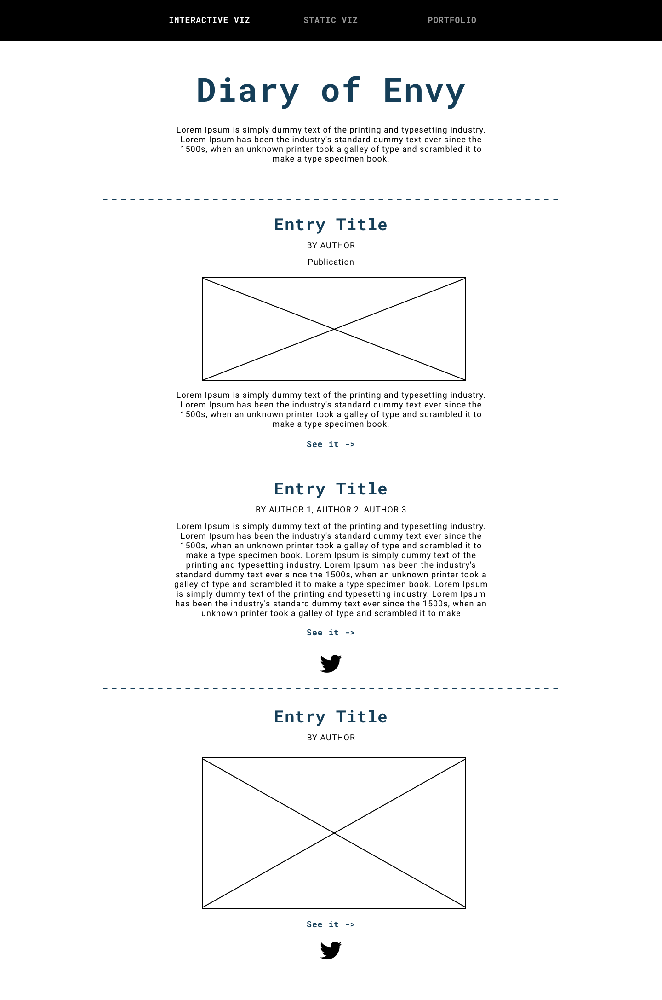

# Weekly Assignment 11
This assignment consists of designing the interfaces for the three data sources we’ve worked with this semester. The following designs will consist of sketches, materials, and documentation, including (at a minimum):

* What will the visualization look like? Will it be interactive? If so, how?
* How will the data need to be mapped to the visual elements?
* For that mapping, what needs to be done to the data? Be specific and clear. Will it require filtering, aggregation, restructuring, and/or something else? How will this be done?
* What is the default view (if any)?
* What assumptions are you making about the user?

NOTE: This documentation details the ideal state of each project, not *necessarily* what I'll deliver by the culmination of this specific course (these final projects are due on 12.14.18). Additionally, these designs are also focused **only on desktop users** (for now) - I do not expect to complete any mobile designs by the culmination of this course.

---

# Alcoholics Anonymous
**Title:** Alcoholics Anonymous Meeting Finder
**Description:** Help find an AA meeting when and where you need it.

#### Design and Interactivity:
* The visualization will be a map with a pointer for each meeting (geo)location. These location markers will be colored based on the distance away from a (current) location.
* The viz will be interactive - users will be able to change which locations they're seeing based on relevant meeting types, distance from a specific location (ideally with an option to use "my location"), and time from now
* Users can click on a specific meeting to get (more) information about that Location, including:
  * Location Name
  * Location Address (with detail)
  * Meeting Name
  * Meeting Type
  * Meeting Schedule (for meetings in the selected timeframe)
  * Meeting Details

#### Mapping to Visual Elements:
* The data will first need to be mapped to location markers on my map – there will be one pointer per (geo)location with at least one meeting matching the parameters selected. This primary level of data will only communicate location and distance away from the address selected
    * Then I will need to have detailed data for each location marker (outlined above) that will need to be loaded into a div that I can show/hide once a data point is clicked on, in a similar fashion to how Google Maps shows/hides their detail and search pane

#### Data Manipulation:
* I’ll end up needing to do somewhat complicated data manipulation in order to (1) get the right subset of data out of the database and (2) structure it in the right way for front-end visualization. I'll need to:
    * Facilitate the address search to a lat/lon so that I can find meeting locations only within a certain radius of that location *(in ideal state - for now I will default to Parsons)*
    * Translate the generic schedule I have (e.g. Sundays 2:30 - 3:30) to a relative range starting with the current time (e.g. which meetings will start in the next 72 hours? 24 hours? 2 hours?)
    * Join this data together following the [database structure](https://github.com/ryanabest/data-structures/blob/master/week4/data-structures_week4.md) I laid out in designing these relations to get all the relevant into for all the meetings that fall within the meeting type, location, and time filters passed in by the user
    * Create a relevant nesting structure that first provides geolocations (for the map), then locations within that lat/lon, then meetings at that location, then schedules of those meetings

#### Default View:
* Default view will be a set of values passed into the filters, for example “I need any meeting within 2 miles of 66 5th Avenue in the next 5 hours." This will show a map with all meetings that match this parameter on the map, with the option to click for more details on those meetings. My first prototype will have this filter sentence as static, and I will add in functional user inputs from there.

#### User Assumptions:
* I’m making the following assumptions about the user:
    * They are only looking for a meeting to attend that is close to their (current?) location and close to the current time *(they are NOT building a schedule/calendar or saving future meetings)*
    * Important factors for deciding what meeting to attend are proximity, timing, and meeting type
    * Proximity to their current location is the most important factor to them (hence why it will be visually prioritized in the map and on the colors within the map)
    * They only care about meetings in Manhattan
    * They will not need to search for meetings based on any meeting details (like wheelchair access) or meeting special interests *(let's start with this assumption, and evaluate whether it's worth adding filtering functionality for these fields a bit later on)*

#### Sketches:
##### Default View

##### User Interaction

---

## Sensor Data
* **Title:** How Insulated am I from the Temperature Outside?
* **Description:** An exploration of how external weather might cause the temperature right inside my window to fluctuate.

#### Design and Interactivity:
* The primary visualization will use a [difference chart](https://flowingdata.com/charttype/difference-chart/), which fills in the space between lines to highlight the greater-than and less-than differences over time
  * There will be one line for the inside temperature and one line for the outside temperature that share the same axis (with both a Faren)
  * The difference between these two lines will be filled in by bars, with one bar for each hour. The color of this bar will either be a gradient from the inside color to the outside color or portray the value of the difference between the inside/outside temperatures
  * The only interactivity present in this design will be a hover state; ideally, when you hover over one of these hour bars (on desktop), you get some more detail on the outside weather at that time. This will hopefully prompt some exploration and seeing if specific patterns in outside temperature drive dramatic differences, including:
      * Inside / Outside Temperature
      * Summary (clear / partly cloudy / etc)
      * Precipitation (probability and type)
      * Cloud cover / UV Index
      * Apparent Temperature
      * A big consideration here is that the hour bars will end up being so small that users won’t be able to effectively hover on only one - maybe hovering for the day is better if that's the case

#### Mapping to Visual Elements:
* Data will need to be mapped to visual elements by generating svg elements with sizes, positions, and colors that correlate with values of each data element
    * One line for inside, one line for outside with y position based on average temperature and x position based on time. Color of line based on inside/outside.
    * One bar for each hour, with a x position based on time and y-position/size based on difference between outside/inside temperature. Current designs will have the color of these bars as a gradient between the inside/outside temperatures.
    * One div per hour (or day) with the detailed weather data outlined above made visible upon hover.

#### Data Manipulation:
* I’ll need to do some aggregating, sorting, and filtering of my data:
    * Compute average Particle temperature readings for each hour
    * Join these Particle temperature averages to my hourly Darksky table that has outside temperature at my exact address by the hour to calculate difference between the average temperature inside for that hour with the registered temperature outside
    * Since I didn’t push this code up to an EC2 sever, there are a few points where I have missing data from the inside temperature (32 data points), so I’ll need to fill in gaps of missing readings by assuming a linear increment between the last two known readings (before and after any outages)
    * Potentially also join my hourly readings to daily Darksky table to bring in weather detail on the daily level (if I end up showing daily tooltips over hourly tooltips)

#### Default View:
* The default view will be the full visualization shown (after the title and some intro text) without a hover state shown - user activity shouldn't alter this default state until a hover action is taken.

#### User Assumptions:
* I’m making the following assumptions about the user:
    * The most important information to them is the difference between the inside/outside temperature
    * They care about seeing all data within the timeframe logged **in aggregate** *(they aren't interested in filtering this view to a specific timeframe)*
    * They have decent amount of data literacy (since a difference chart is a moderately complex visualization)

#### Sketch:

---

## Dear Diary
* **Title:** Diary of Envy
* **Description:** Diary of projects and portfolios provide me equal parts inspiration and rampant jealousy.

#### Design and Interactivity:
* This visualization will look like a blog post with a long scroll, with one “row” per entry stacked vertically (in [this](https://www.bloomberg.com/features/2017-jealousy-list/) style). There will be interactivity, with the user’s ability to filter for either (1) interactive viz, (2) static viz, or (3) portfolio. Users will be able to choose one of those three options, and the long scroll will be replaced with entries of only that type.

#### Mapping to Visual Elements:
* Data will need to be mapped to (mostly text) HTML elements, with the project title as the overall entry title (*h1*), the authors as the second line (*h2*), and additional aspects of the entry mapped to other HTML elements. The most important additional pieces will be the:
    * Publication
    * Project preview (*img*)
    * Summary of my thought(s) (*p* or *ul*)
    * Link to the project (*a*)
    * Social link (with twitter icon) (*img* & *a*)
* As of now I’ll be including every element I’ve logged within the nested “info” element, except tags (which would add an exciting element of selecting/filtering to my page, but would require a more extensive filtering infrastructure than the three filters in the current scope – tags would also be most relevant if I had more data than I will plan on having by the time I roll this out into a prototype)
* If my thought text list ends up being too long, I can just take the first element in the list and use that as a summary, then either forego other thoughts or figure out a way to hide this extra detail behind an additional interaction layer (have some way to go from summary view —> detail view)

#### Data Manipulation:
* I won’t need to do any aggregation here, but I will need to filter, sort, and restructure my data coming out of DynamoDB to construct the HTML code that will be appended to my index.html file:
  * I will probably need to bring a lot of my data out of the nested structure I created, since I need to create an HTML element for each individual aspect of the entry whether its inside or outside of my nested “info” element. This reflects a bit of an unintended difference from what I expected to do in my [original database design](https://github.com/ryanabest/data-structures/blob/master/week5/data-structures_week5.md) - this data structure will still work for these purposes, but I won't really be using the nesting as anticipated.
  * The data will need to be filtered (based on which entry type is selected) then sorted (by date added to the diary descending).
  * I’ll then need to look within each entry that comes back from that query to see if individual elements I want to show are present, using those elements to generate html code.
  * For instance, I’ll need to wrap the project title in *h1* tags, the author in *h2* tags, and so on.
  * I’ll likely use either [handlebars](http://handlebarsjs.com/) or the [HTML Document API](https://developer.mozilla.org/en-US/docs/Web/API/Document) to make each HTML page data-driven.

#### Default View:
* The default view will be interactive viz selected, with ALL interactive viz projects present on the page ordered by date added to the diary (descending).

#### User Assumptions:
* I’m making the following assumptions about the user:
    * They are somewhat familiar with or interested in data visualization projects / story-telling / journalism (i.e. would be a similar user base for sites like [Bloomberg’s Jealousy List](https://www.bloomberg.com/features/2017-jealousy-list/) or [FiveThirtyEight’s ‘Damn, We Wish We’d Done These'](https://fivethirtyeight.com/features/damn-we-wish-wed-done-these-4-stories-last-month/)
    * The most important pieces of information to them are a general overview / preview of what each project is, why I included it, and a link to the project itself
    * They will only care to see one project type at a time (interactive viz / static viz / portfolio)
    * The most recently added project will be most relevant to them (since any repeat users will want to see newest additions first)

#### Sketch:

