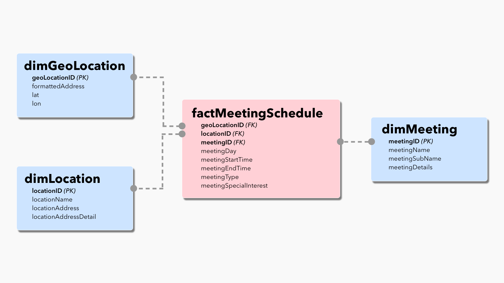

# Data Structures Week 4

## Relational Database for our AA Data
This week, I continue to work with the data I scraped, parsed, and augmented in the previous three weeks to write this AA data to a relational database.

----
## Planning my Relational Database
1. I will plan on storing my AA data in **normalized** relations in order to more readily understand the *unique* locations that house AA meetings. This approach will avoid potential headaches that may arise from attempting to map overlapping location beacons with identical Lat-Lon coordinates, and will allow me the most flexibility. For example, a star schema will allow for the possibility that a meeting can occur at multiple locations and that one address can house multiple locations. Each unique meeting instance (which I'll call a schedule) will be attributed to a known meeting, location, and geoLocation.
2. I will structure my data in a [star schema](https://medium.com/data-ops/why-do-i-need-a-star-schema-338c1b029430). With this approach, each individual table will contain the least amount of data needed to convey critical information, optimizing storage efficiency and providing ease of understanding/visualizing data at higher levels of hierarchies without needing to duplicate this data.
3. My general hierarchy will follow this outline, with each following item in the list constituting a more granular piece of data about a specific meeting that inherits characteristics from all proceeding data points:

>1. Geo Locations (Addresses and Lat-Lons)
>2. Locations (Building Names and/or Address Details)
>3. Meetings (Meeting Names and Meeting Details)
>4. Meeting Schedules (Day/Times, Meeting Types, Special Interest)

