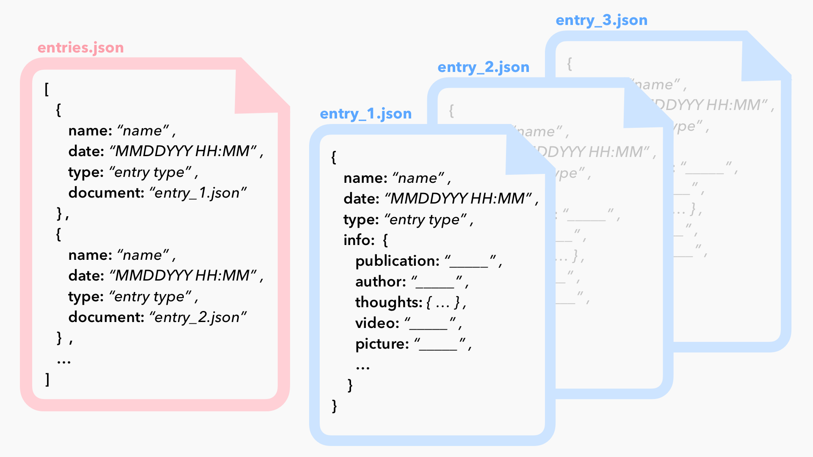
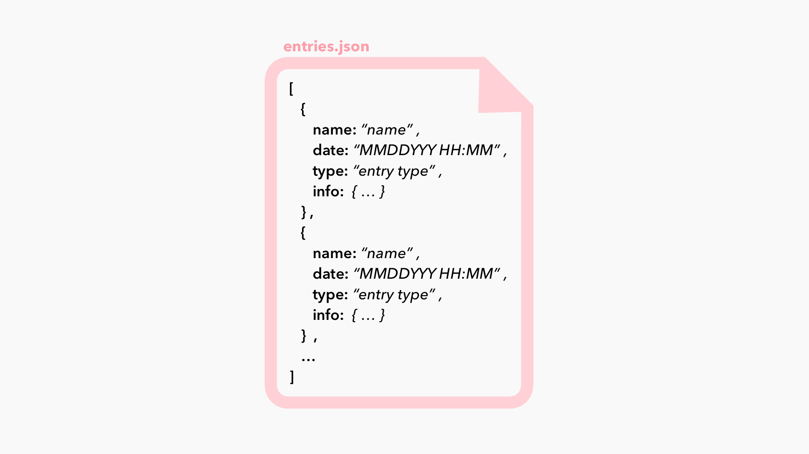

# Data Structures Week 5

## NoSQL Database for our Dear Diary project
This assignment plan out how I will approach building a NoSQL database for what I'll be collecting for our Final Assignment 2, "Dear Diary". For this project, I'll be focusing on entries that profile a data viz project or designer that I either like or want to critique. I want to have the flexibility to include a range of content on each project, including descriptions of the project, various multimedia elements that preview the project visuals or functionality (e.g. images, videos, etc),  

----

## Planning my NoSQL Database
1. I will plan on storing my Dear Diary data in a **denormalized** model - this will allow me greater flexibility for include those element(s) in each entry that I think are most relevant to portray the essence of a project/designer that I want to portray, along with my thoughts about it. I don't imagine needing to undergo extensive data manipulation (adding/deleting from each relation) or aggregating across multiple entries, while my core data strucutre (what I want to include with each entry) might be changing over time - in fact, I expect it to. I do not want to eliminate any redundancies within each individual entry, since I want each to contain all necessary information about that entry.

2. Ideally, I want this data to "come out of the database" in a structure that will allow me to easily understand **all** the elements that I'll need to represent or include in a front-end environment. If I think of each entry getting it's on *div* on a webpage, I want this data to include every individual element that I need to be included within that container. I don't think I'll be able to do this purely in the data documents themselves (e.g. won't include h1 tags or css styling within my JSON documents), but ideally each item within the entry will have all the information to be represented somewhat "grouped" or "labeled" based on how it will be created differently in HTML/CSS (e.g. different HTML element for images versus text versus headlines, different CSS classes for different types of write-ups, etc.).

3. I want my general hierarchy to be relatively loose and flexible, and am planning on using a **semi-structured [Document Database](https://aws.amazon.com/nosql/document/)**. For each entry, I want to utilize **nesting** within JSON documents to benefit from the flexibility of a NoSQL database design; I'm envisioning the following hierarchical structure (the details of which are rather loose right now, as it's currently populated with examples of the kinds of things I'll want to take note of and track):

  * **date** *(date of entry)*
  * **name** *(name of project or designer)*
  * **type** *(designer? project? bad graph? design studio?)*
  * **info** *(all the different info that I may want to include about this entry):*
    * **publication** *(if project)*
    * **author** *(if project)*
    * **thoughts**: *(what did I think about the project? string or list*
    * **picture** *(preview picture?)*
    * **video** *(preview video?)*
    * **link** *(where can I find the full project)*
    * **social** *(did this person tweet out about this project? what does their twitter bio look like? instagram? this has become much more interesting to me as I think about sharing projects to a broader audience)*
    * **awards** *(has this person/project won any awards it's worth mentioning?)*

Name, date, and type will be required for each element, since this would be the information I'd want to display in a preview div for each entry on a front-end webpage. *I would also consider adding some kind of multi-media preview to this first level of hierarchy, requiring it for each entry.*

Everything inside the **info** level of hierarchy would be somewhat 'optional' - this would be extra detail to include in a more extensive write-up or feature page for each entry. This level of hierarchy can contain a text-heavy string or list detailing my thoughts around this entry and why I decided to include it, references to images or video examples of the piece, or other aspects I think relevant to share. Each of these aspects within info can be one datapoint or a list of multiple datapoints - for this reason the NoSQL design fits this project perfectly.

------

## Data Model
In terms of organizing the document(s) in my semi-structured document-oriented NoSQL database, I am considering two similar but distinct structures. I'm envisioning having one "master" document that has a running list of each entry in my project, either including links to individual documents that contain the full detail for that entry...

... or with this full detail nested within that one document

As I start my data collection process, I will use the model that uses **one document** that contains all the exhaustive detail on a specific entry nested within its contents. I think the volume of data needed for this project doesn't require creation of multiple documents, while the hierarchy that has *name*, *date*, and *type* together will allow me to access either summary or detail information from this same document. If this approach becomes unorganized or inefficient, I can always split each entry into separate documents after I've done some of the data collecting.
